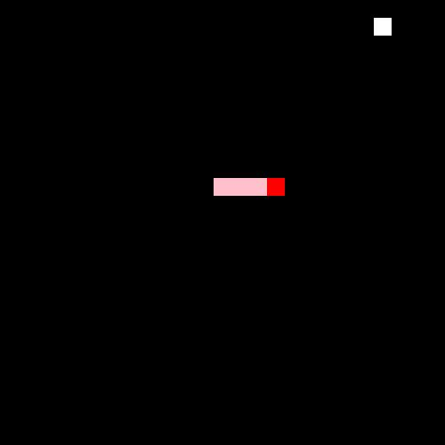
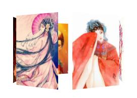
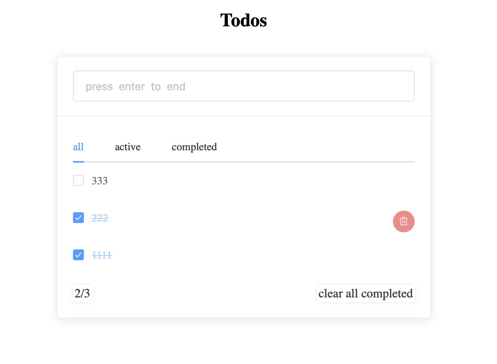
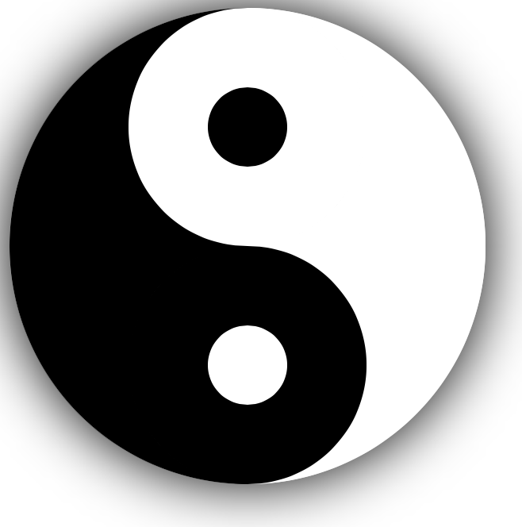
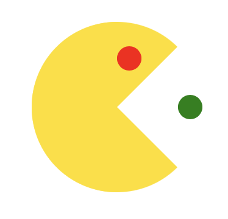
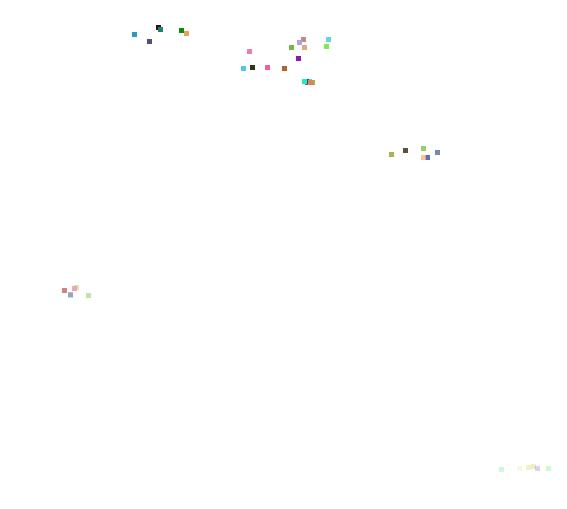
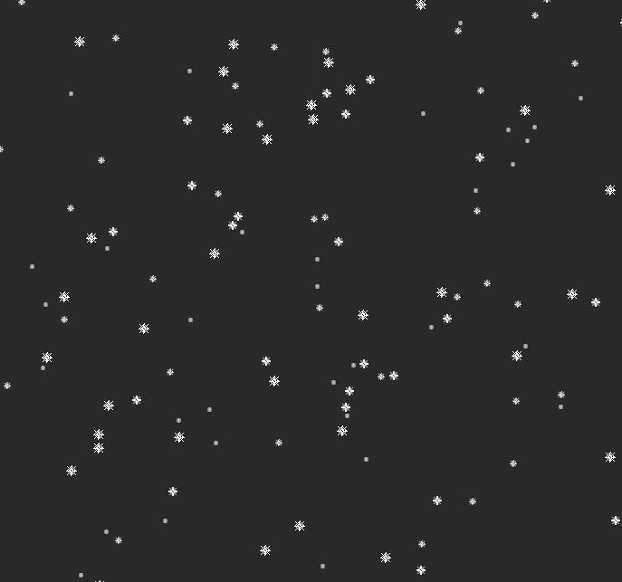

# About this repository
> Several years ago, I worked as a programming teacher. During that time, I generated many program demos. Here are some of them.

## miniJQ
* The simplified version of mimicking JQuery 

## simpleSnake
* Don't use any third-party libraries to build the snake game ( you can use miniJQ to replace standard jquery )

## 3D-Carousel
* Include two versions: one with just pure CSS and HTML, and another including JavaScript.

## vue-todos
* A todos application coding by vue

## graphics
* Some strange graphics， just coding by css + html

## 2D-Carousel
* A simple 2d-carousel demo

## click-effects
* When you click the screen , some particles will be generated

## snowflake-effects
* The screen will be full of snowflakes

